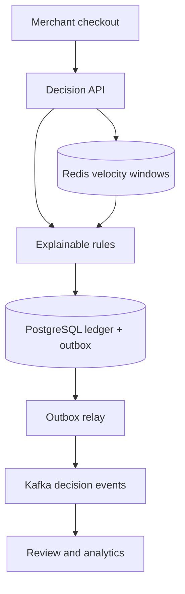

# Real-Time Fraud Decisioning Platform

A production-minded Java 17 service that makes explainable fraud decisions on the transaction path, persists immutable evidence, and reliably distributes decision events through Kafka.

## Why recruiters should care

This repository demonstrates backend engineering beyond CRUD: tenant-scoped idempotency, deterministic risk scoring, auditable reason codes, transactional messaging, concurrency-safe workers, schema migrations, and failure-aware API design.

## Current capabilities

- `APPROVE`, `REVIEW`, or `DECLINE` decisions with bounded risk scores
- Explainable rules for country mismatch, transaction value, card-not-present, and account age
- Distributed account, device, and IP velocity rules using Redis sorted sets
- Atomic sliding-window updates through a server-side Lua script
- Configurable `FAIL_REVIEW` or `FAIL_OPEN` behavior during Redis outages
- Immutable tenant-specific rule-set drafts with controlled activation
- Database-enforced single active rule version per tenant
- Exact rule-set version recorded with every decision for audit replay
- Canonical SHA-256 request fingerprints
- Exact idempotent replay and `409 IDEMPOTENCY_CONFLICT` protection
- Tenant-isolated reads and idempotency keys
- PostgreSQL decision ledger with Flyway-managed constraints
- Transactional outbox and Kafka relay using `FOR UPDATE SKIP LOCKED`
- Automatic review-case creation for every `REVIEW` decision
- Exclusive analyst leases with expiry and safe reassignment
- Guarded approve/decline resolution with immutable audit history
- Transactional `FRAUD_REVIEW_RESOLVED` events
- Prometheus-ready Spring Boot Actuator endpoints
- Unit tests, Docker Compose, CI, and executable API examples

## Architecture



See [the architecture decisions](docs/architecture.md) and [API examples](docs/api-examples.http).

## Run locally

```bash
mvn clean package
docker compose up --build
```

The API is available on `http://localhost:8080`; health is exposed at `/actuator/health`.

## Production direction

This is the fourth increment of a fourteen-step build. Planned work includes model shadowing, feedback ingestion, OpenTelemetry, security, SLOs, load testing, and AWS deployment patterns.

## Technology

Java 17 · Spring Boot 3.5 · PostgreSQL 16 · Kafka · Redis · Flyway · Prometheus · Docker · GitHub Actions

## License

MIT
